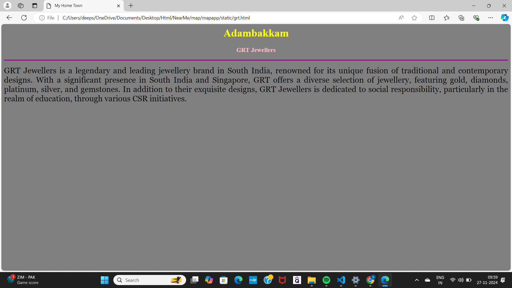
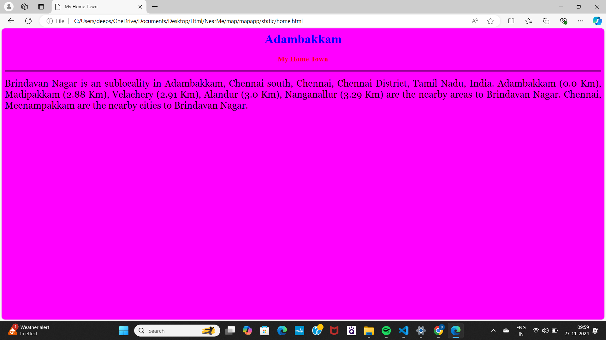
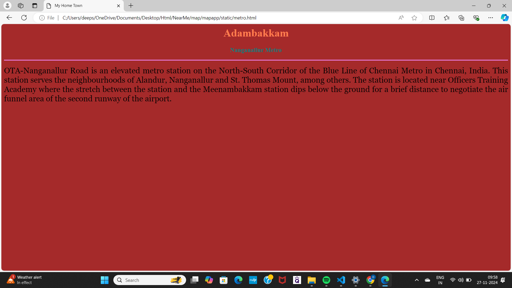
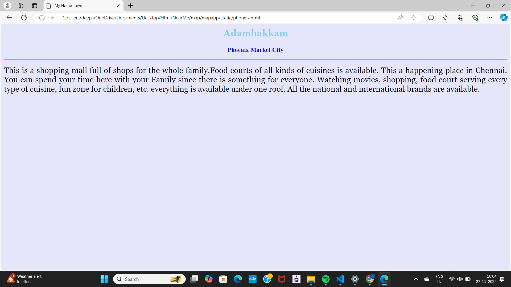
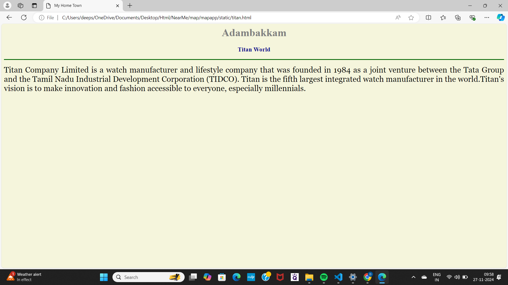
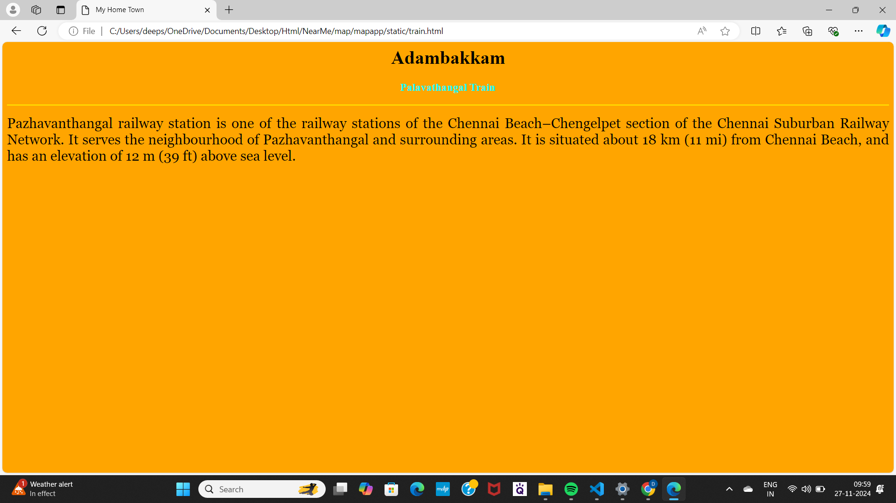

# Ex04 Places Around Me
## Date: 27.11.2024

## AIM
To develop a website to display details about the places around my house.

## DESIGN STEPS

### STEP 1
Create a Django admin interface.

### STEP 2
Download your city map from Google.

### STEP 3
Using ```<map>``` tag name the map.

### STEP 4
Create clickable regions in the image using ```<area>``` tag.

### STEP 5
Write HTML programs for all the regions identified.

### STEP 6
Execute the programs and publish them.

## CODE
```
map.html 
<html>
    <head>
        <title>My City</title>
    </head>
    <body>
        <h1 align="center">
            <font color="red"><b>Adambakkam</b></font>
        </h1>
        <h3 align="center">
            <font color="blue"><b>Deepshika Hemanth kumar(24008389)</b></font>
            </h3>
            <center>
                    

                    

    <map name="image-map">
    <area target="" alt="" title="My Home Town" href="home.html" coords="649,321,1077,130,1166,174,1202,752,1033,784,826,674,772,632" shape="poly">
    <area target="" alt="" title="Phoneix Market City" href="phoneix.html" coords="1203,255,1417,316" shape="rect">
    <area target="" alt="" title="Nanganallur road metro" href="metro.html" coords="492,62,711,127" shape="rect">
    <area target="" alt="" title="Titan World" href="titan.html" coords="1386,396,1528,447" shape="rect">
    <area target="" alt="" title="Palavathangal Train" href="train.html" coords="340,359,496,411" shape="rect">
    <area target="" alt="" title="GRT Jewellers" href="grt.html" coords="1384,572,1633,621" shape="rect">
      </map>
                        
                    
            </center>
    </body>
    </html>

grt.html
    <html>
<head>
<title>My Home Town</title>
</head>
<body bgcolor="grey">
<h1 align="center">
<font color="yellow"><b>Adambakkam</b></font>
</h1>
<h3 align="center">
    <font color="pink"><b>GRT Jewellers</b></font>
</h3>
<hr size="3" color="purple">
<p align="justify">
    <font face="georgia" size="5">

        GRT Jewellers is a legendary and leading jewellery brand in South India,
        renowned for its unique fusion of traditional and contemporary designs. 
        With a significant presence in South India and Singapore, GRT offers a diverse 
        selection of jewellery, featuring gold, diamonds, platinum, silver, and gemstones. In addition to their 
        exquisite designs, GRT Jewellers is dedicated to social responsibility, 
        particularly in the realm of education, through various CSR initiatives.


    </p>    
    </font>
</body>
</html>

home.html
<html>
<head>
<title>My Home Town</title>
</head>
<body bgcolor="magenta">
<h1 align="center">
<font color="blue"><b>Adambakkam</b></font>
</h1>
<h3 align="center">
    <font color="red"><b>My Home Town</b></font>
</h3>
<hr size="3" color="black">
<p align="justify">
    <font face="georgia" size="5">

        Brindavan Nagar is an sublocality in Adambakkam, Chennai south, Chennai, Chennai District, Tamil Nadu, India.

        Adambakkam (0.0 Km), Madipakkam (2.88 Km), Velachery (2.91 Km), Alandur (3.0 Km), Nanganallur (3.29 Km) are the nearby areas
         to Brindavan Nagar.
        
        Chennai, Meenampakkam are the nearby cities to Brindavan Nagar.


    </p>    
    </font>
</body>
</html>

metro.html
<html>
<head>
<title>My Home Town</title>
</head>
<body bgcolor="brown">
<h1 align="center">
<font color="coral"><b>Adambakkam</b></font>
</h1>
<h3 align="center">
    <font color="teal"><b>Nanganallur Metro</b></font>
</h3>
<hr size="3" color="violet">
<p align="justify">
    <font face="georgia" size="5">
        OTA-Nanganallur Road is an elevated metro station on the
         North-South Corridor of the Blue Line of Chennai Metro in Chennai, India.
          This station serves the neighbourhoods of Alandur, Nanganallur and St. Thomas Mount, among others.
          The station is located near Officers Training Academy where the stretch between the station and the
           Meenambakkam station dips below the ground for a brief distance to negotiate the air funnel area
            of the second runway of the airport.
    </p>    
    </font>
</body>
</html>

phoneix.html
<html>
<head>
<title>My Home Town</title>
</head>
<body bgcolor="lavender">
<h1 align="center">
<font color="skyblue"><b>Adambakkam</b></font>
</h1>
<h3 align="center">
    <font color="blue"><b>Phoenix Market City</b></font>
</h3>
<hr size="3" color="red">
<p align="justify">
    <font face="georgia" size="5">
        This is a shopping mall full of shops for the whole family.Food courts of all kinds of cuisines is available.
        This a happening place in Chennai. You can spend your time here with your Family since there is something for
        everyone. Watching movies, shopping, food court serving every type of cuisine, fun zone for children, etc.
        everything is available under one roof. All the national and international brands are available.
    </p>    
    </font>
</body>
</html>

titan.html
<html>
<head>
<title>My Home Town</title>
</head>
<body bgcolor="beige">
<h1 align="center">
<font color="grey"><b>Adambakkam</b></font>
</h1>
<h3 align="center">
    <font color="darkblue"><b>Titan World</b></font>
</h3>
<hr size="3" color="darkgreen">
<p align="justify">
    <font face="georgia" size="5">
        Titan Company Limited is a watch manufacturer and lifestyle company that 
        was founded in 1984 as a joint venture between the Tata Group and the
         Tamil Nadu Industrial Development Corporation (TIDCO). Titan is the fifth 
         largest integrated watch manufacturer in the world.Titan's vision is to make
          innovation and fashion accessible to everyone, especially millennials. 
    </p>    
    </font>
</body>
</html>


train.html
<html>
<head>
<title>My Home Town</title>
</head>
<body bgcolor="orange">
<h1 align="center">
<font color="black"><b>Adambakkam</b></font>
</h1>
<h3 align="center">
    <font color="cyan"><b>Palavathangal Train</b></font>
</h3>
<hr size="3" color="gold">
<p align="justify">
    <font face="georgia" size="5">
        Pazhavanthangal railway station is one of the railway stations of the Chennai 
        Beach–Chengelpet section of the Chennai Suburban Railway Network. It serves the 
        neighbourhood of Pazhavanthangal and surrounding areas. It is situated about 
        18 km (11 mi) from Chennai Beach, and has an elevation of 12 m (39 ft) above sea level.
    </p>    
    </font>
</body>
</html>

```

## OUTPUT









## RESULT
The program for implementing image maps using HTML is executed successfully.
